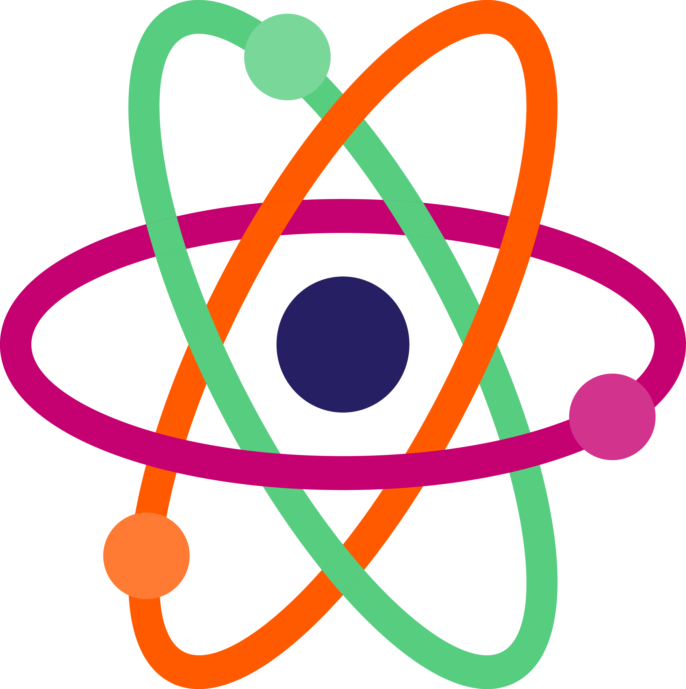
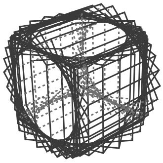

<!-- .slide: style="text-align: left"-->
## A basic introduction to the tokamak.
Notes: By IS, 2021. Cite if you can.
---
<!-- .slide: data-auto-animate -->
## What is fusion?
Notes: Before we can talk about nuclear fusion reactor design, we should take a couple steps back and first ask ourselves what fusion is.
---
<!-- .slide: data-auto-animate -->
## What is fusion?
<!--.element height="20%" width="20%" -->
Notes: All matter is composed of atoms, which in turn are composed of a positively charged nucleus and a negatively charged electron cloud surrounding each atom. The nucleus is held together by an elementary force called the *nuclear strong force,* a force much more powerful than the electromagnetic force, but only at very small lengths, such as the atomic domain.
---
<!-- .slide: data-auto-animate -->
## What is fusion?
<!--.element height="20%" width="20%" -->
Notes: All matter is composed of atoms, which in turn are composed of a positively charged nucleus and a negatively charged electron cloud surrounding each atom. The nucleus is held together by an elementary force called the *nuclear strong force,* a force much more powerful than the electromagnetic force, but only at very small lengths, such as the atomic domain.
---
<!-- .element height="40%" width="40%" -->
Notes: When two nuclei come close enough together, the attractive strong force overcomes the repulsive electromagnetic force and the atoms combine, releasing energy in the form of light and heat. In addition, there are usually byproducts of the reaction, such as alpha or neutron radiation).
---

<!-- .element class="fragment" -->
Notes: hopefully it takes 2 clicks to get to the spinny cube bc its supposed to be fragmaented
